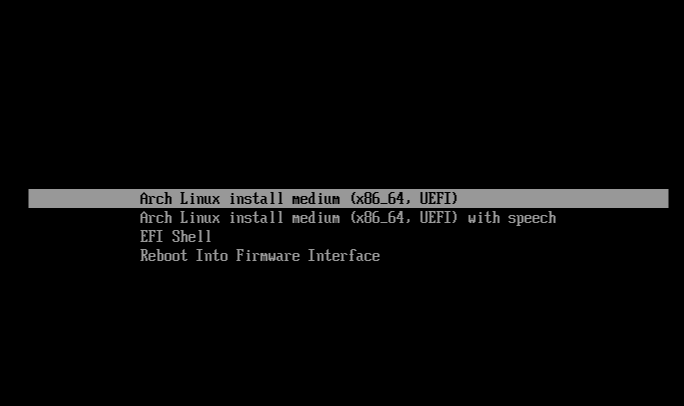
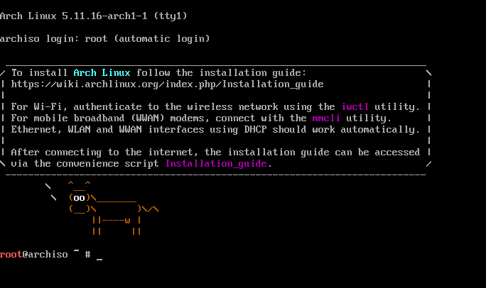
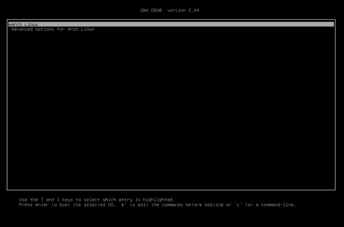
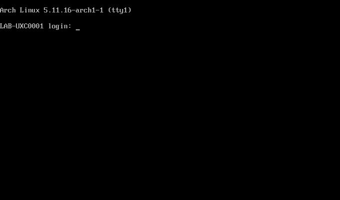

# Building Arch Linux with on Hyper-V:

 &nbsp;&nbsp;&nbsp;&nbsp;&nbsp;&nbsp;&nbsp;&nbsp;&nbsp;&nbsp;&nbsp;&nbsp;&nbsp;&nbsp;&nbsp;&nbsp;&nbsp;&nbsp;&nbsp;&nbsp;&nbsp;&nbsp;&nbsp;&nbsp;&nbsp;&nbsp;&nbsp;&nbsp;&nbsp;

[Official guide](https://wiki.archlinux.org/title/Installation_guide) without modifications for my own requirements.

#### Software and hardware specification for this build:

* Hostname: LAB-UXC0001
* RAM: 1GiB
* Storage: x1 VHDX @ 6GiB
* Network: Hyper-V Network Adapter using DHCP
* Hyper-V Switch: External
* DVD Drive for ISO
* Bootloader: GRUB
* Extra packages in build:
    * grub
    * efimgr
    * networkmanager
    * vi
    * hyperv

## VM Build:

Using the above VM hardware settings, create this VM:

```powershell
New-VM -Name 'LAB-UXC0001' -MemoryStartupBytes '1073741824' -Generation 2 -NewVHDPath 'X:\Virtualisation\Hyper-V\Clients\LAB-UXC0001\Virtual Hard Disks\New Virtual Hard Disk.vhdx' -NewVHDSizeBytes '6442450944' -SwitchName 'LAB-EXTSWT-01' -Path 'X:\Virtualisation\Hyper-V\Clients\LAB-UXC0001'

# I then create the DVD device and attach the .ISO to the VM:
Add-VMDvdDrive -VMName 'LAB-UXC0001' -ControllerLocation 1 -ControllerNumber 0 -Path 'X:\UNIX\Linux\Arch Linux\System Builds\archlinux-2021.05.01-x86_64.iso'

# I disable dynamic memory, secure boot then reconfigure the boot options::
Set-VM -Name 'LAB-UXC0001' -StaticMemory
$VMDVDDrive = Get-VMDvdDrive -VMName 'LAB-UXC0001'
Set-VMFirmware -VMName 'LAB-UXC0001' -EnableSecureBoot Off -FirstBootDevice $VMDVDDrive
```

## OS Build:

Verify the PGP signatures as per [the official instructions](https://wiki.archlinux.org/title/Installation_guide#Verify_signature)

1. Boot the OS from the liveCD and select the first boot option:

 

2. This should lead to the default shell:



3. Change console keyboard layout:

```bash
loadkeys uk
```

4. I am using a UFI capable device so verify efivarfs variables are available: 

> **Note**: We will need to also verify the memory size the system is booted with, i.e 64bit.

```bash
ls -l /sys/firmware/efi/efivars
cat /sys/firmware/efi/fw_platform_size
```

5. I obtained IP addressing via DHCP so verify this device has connectivity to build the distribution:

```bash
ip addr show
```

6. Configure the NTP client to sync from an NTP source and configure the time zone:

```bash
timedatectl set-timezone Europe/London
timedatectl set-ntp true
```

7. The partitioning and sizing is based on a 6GiB .VHDX disk. The partitioning Partition the disk as follows:

| Disk | Size |
| --- | --- |
/dev/sda | 6GiB

| Device | Partition Table |
| --- | --- |
/dev/sda | GPT

| Partition # | Sectors | Partition Type | Size |
| --- | --- | --- | --- |
1 | 2048 - 411647| EFI Filesystem | 200M
2 | 411648 - 12582878 | Linux Filesystem | 5.8GiB

* Set the disk partiton table as GPT:

```bash
fdisk /dev/sda
: g
```

* Create the EFI partition:

```bash
: n
: 1
# Confirm default start sectors and then for end sectors:
: +200M
# Set the filesystem type to EFI Filesystem:
: t
: 1
```

* Create the Linux partition:

```bash
# Create the next partition and confirm the default start and end sectors:
: n
```

* Write the changes to disk:

```bash
: w
```

8. Format the partitions as follows:

| Partition # | File system|
| --- | --- |
1 | FAT32
2 | Ext4

* Create the EFI file system:

```bash
mkfs.fat -F32 /dev/sda1
```

* Create the Linux ext4 file system:

```bash
mkfs.ext4 /dev/sda2
```

9. Mount the file systems we've just created:

* Mount the root partition:

```bash
mount /dev/sda2 /mnt
```

* Create and mount the EFI partition 

```bash
# Create the directory:
mkdir /mnt/boot
# Mount the partition:
mount /dev/sda1 /mnt/boot
```

10. Now install the distribution to the /mnt directory:

```bash
# synchronise databases
pacman -Syy
# Install Arch Linux:
pacstrap /mnt linux linux-firmware base 
```

11. Create the fstab file and update the file with the file systems configured:

```bash
genfstab -U /mnt >> /mnt/etc/fstab
```

12. Change root into the new system:

```bash
arch-chroot /mnt
```

13. Update the hardware clock from the system time:

```bash
# Create symlink from the zoneinfo location to the /etc/localtime:
ln -sf /usr/share/zoneinfo/Europe/London /etc/localtime
# Update the hw clock:
hwclock --systohc
```

14. Allocate the swap file space, set the permissions and create the swap file:

```bash
# Allocate the space:
fallocate -l 2GB /swapfile
# Set the permissions to the directory:
chmod 600 /swapfile
# Create the swapfile
mkswap /swapfile
```

15. Enable swapping with the swapfile:

```bash
swapon /swapfile
```

16. Install a text editor like vi:

```bash
pacman --noconfirm -S vi
```

17. Update fstab with the new swapfile:

```bash
vi /etc/fstab
# Add the below line:
/swapfile   none    swap    defaults 0 0
```

18. Generate the correct locale, mine is en_GB.UTF-8 UTF-8:

```bash
# Uncomment the locate from /etc/locale.gen:
en_GB.UTF-8 UTF-8
# Generate the locale:
locale-gen
```

19. Create the /etc/locale.conf locale config file and set the variable:

```bash
vi /etc/locale.conf
# Add in:
LANG=en_GB.UTF-8
```

20. Update the virtual console config file with the keymaps:

```bash
vi /etc/vconsole.conf
# Add in:
KEYMAP=uk
```

21. Update the hosts file:

```bash
vi /etc/hosts
# Add in
127.0.0.1	localhost
::1		localhost
127.0.1.1	LAB-UXC0001.localdomain	LAB-UXC0001
```

22. Set the hostname of the machine:

```bash
vi /etc/hostname
# Add in:
LAB-UXC0001
```

23. Reset the root password:

```bash
passwd
```

24. Install and configure the GRUB bootloader:

```bash
# Install the grub package:
pacman -S grub efibootmgr --noconfirm
# Install the x86_64 version of GRUB:
grub-install --target=x86_64-efi --efi-directory=/boot --bootloader-id=GRUB
# Create the GRUB config file:
grub-mkconfig -o /boot/grub/grub.cfg
```

25. Install Network Manager so that the interface configurations will be brought up once booted into the new system:

```bash
# First database sync:
pacman -Sy

# Install networkmanager
pacman -S --noconfirm networkmanager
# Enable daemon at start:
systemctl enable NetworkManager
```

25. Unmount the current partitions:

```bash
exit
umount -R /mnt
```

26. Reboot into the new system and discard the liveCD:

```bash
reboot
```

GRUB should be the next presented prompt, followed by the console:





27. After first boot, install the integration tools package:

```bash
pacman -S --noconfirm hyperv 
```